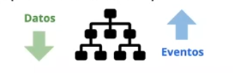

## ¿Qué es un SPA?

Una web SPA (single page applicattion) es una forma de desarrollo web en la que la página web está contenida en un único archivo HTML.

mientras se navega por la web, se irán solicitando contenidos al servidor.

De esta forma se mejoran los tiempos de respuesta y, por lo tanto, la experiencia de usuario.
Hay que hacer esfuerzos extras para aplicar SEO.

## ¿Qué es ReactJS?

React JS es una librería de JavaScript para crear interfaces de usuario.

Esta librería, (QUE NO ES UN FRAMEWORK), fue creada por Facebook en 2013.
Es de código abierto.

React también es famoso por otra serie de características:

* Velocidad
* Componentes
* Desarrollo Declarativo
* Anidación de Componentes (componentes de orden superior y de orden inferior) 
* Isomorfismo
* Agilidad de Desarrollo

 ### Velocidad:

Uno de los aspectos que más destacan de React es su velocidad de renderizado.

Esto lo consigue trabajando sobre un DOM Virtual sobre el que aplica los cambios que sufra la aplicación y luego actualiza únicamente los elementos que se hayan modificado.

### Componentes

docs react: "Los componentes permiten separar la interfaz de usuario en piezas independientes, reutilizables y pensar en cada pieza de forma aislada. "

Al trabajar con componentes estamos forzando nuestro desarrollo a ser más mantenible.

React nos proporciona varios tipos de componentes (Puros, de contenedor, de clase, de función, etc). con los que facilitar su reutilización en todos nuestros proyectos,tanto dentro como entre ellos.
A estos componentes se le puede pasar información a travez de lo que son las props.

### Anidación (de componentes)

Los componentes pueden ser *anidados*, de forma que los componentes de orden superior propagan datos a los de orden inferior.
La comunicación entre ellos es **unidireccional** y se usan los **eventos** para que los componentes inferiores sean **reconocidos** por los de orden superior.

En la Jerarquia haremos pasar la información desde arriba hacia abajo (pasar objetos, datos), Y los eventos suelen ser de abajo hacia arriba.

  

